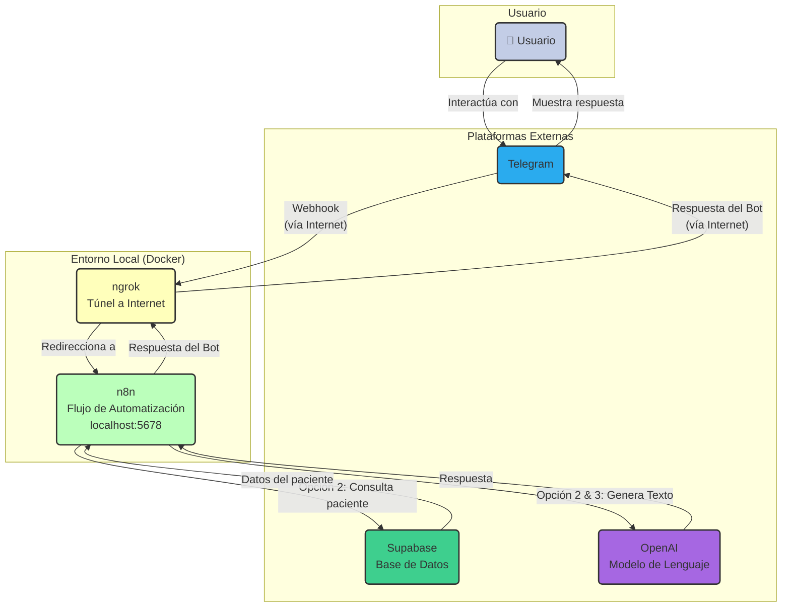

# NutriAITaller

Este proyecto contiene una automatización creada con n8n que interactúa con usuarios a través de un bot de Telegram. El bot es capaz de gestionar diferentes tipos de interacciones gracias a un flujo de trabajo que se ramifica en tres opciones principales.

## Diagrama de Arquitectura

## Descripción de la Automatización

El flujo de trabajo se inicia con un **Telegram Trigger** que se activa cada vez que un usuario envía un mensaje al bot. Un nodo **Switch** analiza el contenido del mensaje y lo dirige a una de las tres ramas disponibles según las reglas configuradas.

### Opción 1: Saludo
- **Descripción:** Una interacción simple para saludar al usuario. Si el mensaje cumple con la condición para esta rama (por ejemplo, contiene la palabra `hola`), el bot responde con un mensaje de saludo predefinido.
- **Nodos Clave:** `Telegram Trigger` → `Switch` → `Saludar (Telegram Sender)`

### Opción 2: Generador de Dietas
- **Descripción:** Este es un flujo más complejo diseñado para generar un plan de alimentación personalizado. El usuario debe enviar un mensaje con un formato específico, como por ejemplo: `/dieta rut 12345678-9 objetivo ganar musculo`.
- **Pasos del flujo:**
    1.  **Code:** Extrae el RUT y el objetivo del mensaje del usuario.
    2.  **Get Patient:** Utiliza el RUT para consultar la base de datos en **Supabase** y obtener la información del paciente.
    3.  **Code1:** Prepara los datos del paciente y el objetivo en un formato adecuado (prompt) para ser procesado por un modelo de inteligencia artificial.
    4.  **Message a model:** Envía la información a un modelo de IA (como GPT) para generar el plan de alimentación.
    5.  **Code2:** Formatea la respuesta del modelo de IA para que sea clara y legible.
    6.  **Telegram: Send Confirmation:** Envía el plan de alimentación final de vuelta al usuario a través de Telegram.

### Opción 3: Asistente de IA General
- **Descripción:** Esta rama permite a los usuarios tener una conversación de formato libre con un asistente de inteligencia artificial. Usualmente, es la opción por defecto si el mensaje no coincide con ninguna de las otras reglas del `Switch`.
- **Pasos del flujo:**
    1.  **AI Agent:** Procesa la conversación utilizando un modelo de chat de OpenAI.
    2.  **Simple Memory:** Mantiene un historial de la conversación actual, permitiendo al bot recordar el contexto y dar respuestas más coherentes y naturales.
    3.  **Responde como asistente:** Envía la respuesta generada por el asistente de IA al usuario por Telegram.